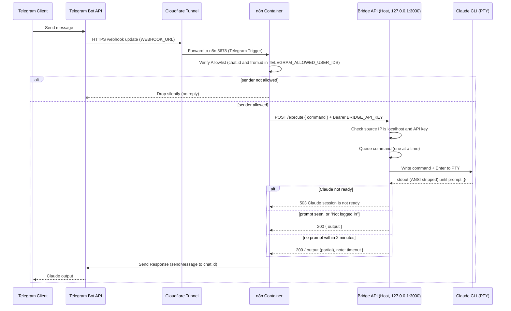

# System Architecture

## Overview
This document describes the architecture of the Telegram ↔ n8n ↔ Claude Code system.

### Components
1. **Telegram Bot**: User interface for sending commands and receiving outputs.
2. **Cloudflare Tunnel (`cloudflared`, optional)**: Publishes n8n's webhook on a public HTTPS hostname so Telegram can deliver updates without opening router ports.
3. **n8n (Dockerized Orchestrator)**: Validates the sender against the allowlist, calls the bridge, and sends the reply.
4. **Local Bridge (Node.js API)**: Exposes a REST API to n8n, managing the underlying `claude` CLI via pseudo-terminal (`pty`).

### System Diagram

### Network Flow

## Component Details

### n8n Orchestrator
Running in Docker with the official `n8nio/n8n` image, published on host port `5680` (`N8N_HOST_PORT` in `.env`).
It reaches the bridge API running natively on the Mac through `host.docker.internal`. It receives only `BRIDGE_API_KEY` and `TELEGRAM_ALLOWED_USER_IDS` from `.env`.

### Cloudflare Tunnel
An optional `cloudflared` container (`docker-compose --profile tunnel`) connects out to Cloudflare and forwards the public hostname in `WEBHOOK_URL` to `http://n8n:5678`. Replies go straight from n8n to the Telegram Bot API and do not use the tunnel. The bridge is never exposed through it.

### Bridge API (`/bridge/claude-session`)
A lightweight Express server built with Node.js.
Uses `node-pty` to spawn `claude` in an interactive shell.
Features:
- Runs `claude` as the PTY process itself (through a login shell for `PATH`) and restarts it if it exits.
- Strips ANSI codes to clean up output.
- Detects Claude's `❯` prompt (or a "Not logged in" message) to determine when Claude has finished execution; falls back to partial output after a 2-minute timeout.
- Runs one command at a time and returns collected output to HTTP requests; returns 503 while Claude is not ready.
- `POST /reset` restarts the session, and `GET /status` reports its state.
- Rejects non-localhost callers and requests without the `Bearer BRIDGE_API_KEY` header.
