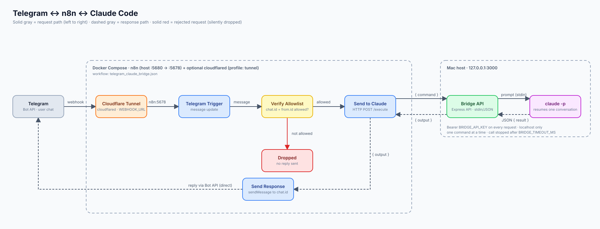
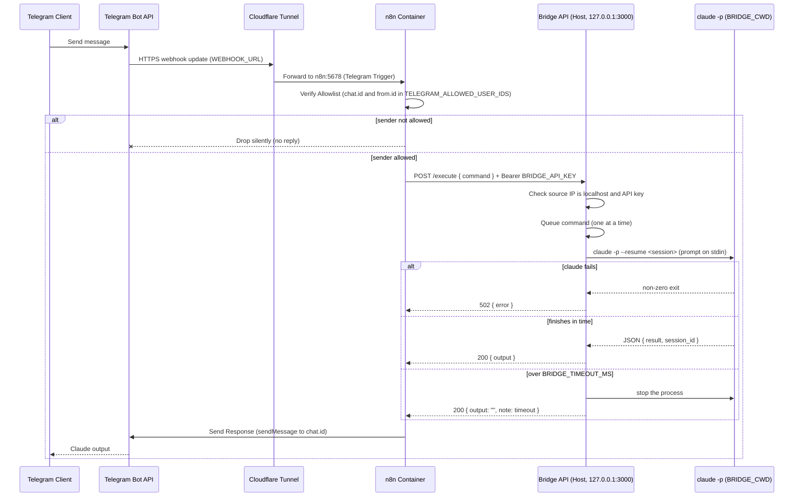

# System Architecture

## Overview
This document describes the architecture of the Telegram ↔ n8n ↔ Claude Code system.

### Components
1. **Telegram Bot**: User interface for sending commands and receiving outputs.
2. **Cloudflare Tunnel (`cloudflared`, optional)**: Publishes n8n's webhook on a public HTTPS hostname so Telegram can deliver updates without opening router ports.
3. **n8n (Dockerized Orchestrator)**: Validates the sender against the allowlist, calls the bridge, and sends the reply.
4. **Local Bridge (Node.js API)**: Exposes a REST API to n8n, running Claude Code headless (`claude -p`) in a dedicated working folder and resuming the same conversation.

### Deployment modes
The bridge and Claude Code always run on the Mac. n8n is either your own existing instance (Mode A, a workflow rendered from the template with `scripts/render-workflow.js`) or the bundled container from `docker-compose.yml` (Mode B). The diagram shows Mode B with the optional Cloudflare Tunnel; in Mode A the Cloudflare box is whatever public URL your n8n already uses. See [deployment.md](deployment.md).

### System Diagram

### Network Flow

## Component Details

### n8n Orchestrator
Running in Docker with the official `n8nio/n8n` image, published on host port `5680` (`N8N_HOST_PORT` in `.env`).
It reaches the bridge API running natively on the Mac through `host.docker.internal`. It receives only `BRIDGE_API_KEY` and `TELEGRAM_ALLOWED_USER_IDS` from `.env`.

### Cloudflare Tunnel
An optional `cloudflared` container (`docker-compose --profile tunnel`) connects out to Cloudflare and forwards the public hostname in `WEBHOOK_URL` to `http://n8n:5678`. Replies go straight from n8n to the Telegram Bot API and do not use the tunnel. The bridge is never exposed through it.

### Bridge API (`/bridge/claude-session`)
A lightweight Express server built with Node.js. It needs no native modules.
For every request it runs `claude -p --output-format json` through a login shell (so `PATH` matches your terminal), with `BRIDGE_CWD` as the working directory and the prompt sent on stdin.
Features:
- **Conversation continuity:** the first call starts a session; its id is kept in `bridge/claude-session/.session` (mode 600, git-ignored) and later calls use `--resume`. If the stored session no longer exists, a new one starts.
- **Permissions:** headless mode has nobody to approve tool use, so Claude gets only the tools in `BRIDGE_ALLOWED_TOOLS` (default `Read,Glob,Grep,Edit,Write,Bash`).
- **Workspace:** `BRIDGE_CWD` is required and cannot be your home directory or `/`.
- Runs one command at a time; a call over `BRIDGE_TIMEOUT_MS` (default 5 minutes) is stopped.
- Adds a short system prompt asking for concise plain-text replies that fit Telegram (`BRIDGE_SYSTEM_PROMPT` overrides it).
- Drops `CLAUDE_CODE_*` variables inherited from a parent Claude Code session.
- `POST /reset` forgets the conversation, and `GET /status` reports `Online`, the workdir, and whether a session exists.
- Rejects non-localhost callers and requests without the `Bearer BRIDGE_API_KEY` header.
